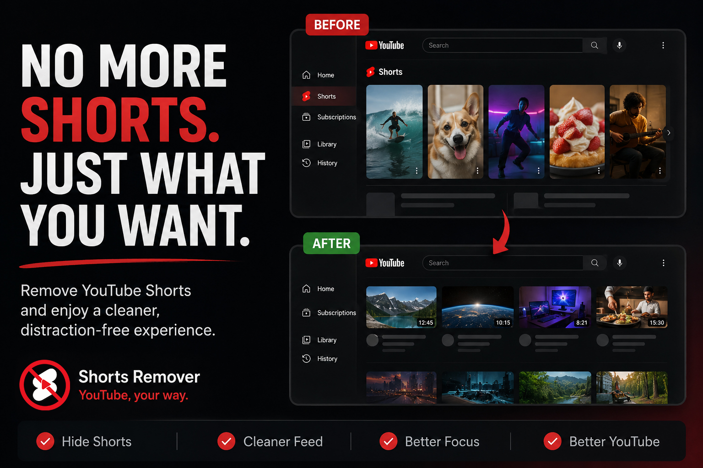

# Shorts Remover

  

**Restore YouTube as it is.** Shorts Remover is a lightweight browser extension that strips YouTube Shorts out of your feed, sidebar, and search results — automatically, continuously, and without sending any of your data anywhere.

## What it does

- Removes the Shorts shelf from your home feed and search results
- Clears the "Shorts" entry from the left sidebar
- Removes Shorts-style grid rows wherever YouTube renders them
- Keeps working as you navigate — YouTube is a single-page app, so cleanup re-runs on every in-app navigation, not just on the first page load
- Watches the page continuously, so Shorts that load in late (scrolling, lazy-loading) get removed too
- One click to enable or disable from the popup — bring Shorts back any time, no reinstall needed

## Install

Not on the Chrome Web Store yet — install it directly from this repo. Takes about a minute either way.

### Chrome
1. Click **Code → Download ZIP** above, then unzip it.
2. Go to `chrome://extensions`.
3. Turn on **Developer mode** (top-right corner).
4. Click **Load unpacked**.
5. Select the unzipped folder — the one with `manifest.json` inside it.
6. Click the puzzle-piece icon in your toolbar, pin Shorts Remover, and make sure it says **Enabled**.

### Opera
Same steps — just open `opera://extensions` instead of `chrome://extensions`. Opera is Chromium-based, so the rest of the flow is identical.

A full walkthrough with screenshots is also available in [`install page`](https://youtubeshortsremover.me/install.html).

## How it works

Shorts Remover runs as a single content script (`content.js`) that:

- Targets known Shorts containers (`ytd-rich-section-renderer`, `grid-shelf-view-model`, the Shorts sidebar entry, and similar shelf renderers) and removes them from the DOM
- Hooks YouTube's own `yt-navigate-start` / `yt-navigate-finish` events, since YouTube never fires a real `load` event after the first visit
- Falls back to a `MutationObserver` plus a periodic safety-net check, in case YouTube's navigation events ever change
- Stores your enabled/disabled preference with `chrome.storage.sync`, so it persists and syncs across your signed-in devices

## Privacy

Shorts Remover doesn't collect, store, or transmit any data. It only touches the DOM of youtube.com pages you're already viewing, locally, in your own browser. Full details in the [Privacy Policy page](https://youtubeshortsremover.me/privacy-policy.html).

## Contributing

Issues and pull requests are welcome. YouTube changes its DOM structure fairly often, so if you spot a page where Shorts slip through, please open an issue with the URL and, if possible, a screenshot of what's not being removed.

## License

[MIT](LICENSE)
